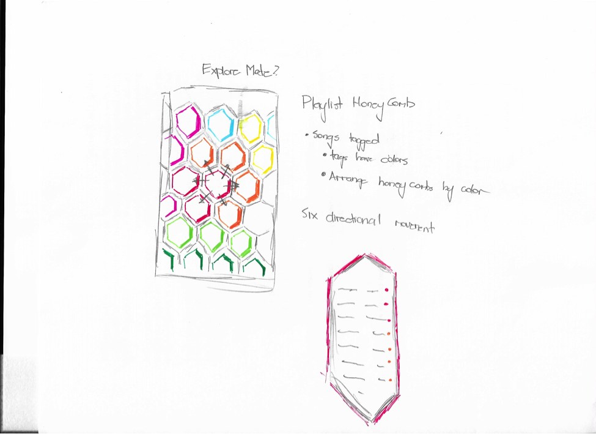

[Home](https://colinauyeung.github.io/CPSC-481--MusicSurf/) - [Stage1](https://colinauyeung.github.io/CPSC-481--MusicSurf/Stage1) - [Stage2](https://colinauyeung.github.io/CPSC-481--MusicSurf/Stage2) - [Stage3](https://colinauyeung.github.io/CPSC-481--MusicSurf/Stage3) - [Stage4](https://colinauyeung.github.io/CPSC-481--MusicSurf/Stage4) - [Stage5](https://colinauyeung.github.io/CPSC-481--MusicSurf/Stage5)    
## Sketches

This is the now playing screen. This idea shows how we want to differentiate our play button from a typical looking play button. Since the app’s design is based around having visuals for songs, we wanted cover art or user chosen images to be displayed in the middle. We had a discussion about holding and moving the buttons left to right to change tracks, but we felt that adding so many layers to a simple action might cause problems, in terms of slips and being too complex for the functionality of the feature.

The idea of this illustration is to demonstrate how the library works. Each node is a song and the connection is based off what mood or genre of music you are listening too.
But we encountered problems when we had a really big library, as the individual colours couldn't be seen in the large blurb of colour and no connections were noticeable. We changed this idea to incorporate a layer of nodes depicting tags or activities. These tags will be used to connect users to songs that are similar to what they are currently listening to. The library was also made so it could depict songs and playlists in organized manner based off tags, instead of just showing the most recently added items. 

We originally wanted to be able to click on nodes to show more details about the network, but we found that this would be very cluttered and problematic because of how many interactions and layers we would need to display all the relevant information.

The idea of this sketch was to show an exploration page that displayed connections between songs and how they were related. The play button would be in the middle of the screen, overlaying the song currently being played. A song’s connections to other songs would be based off genre or mood tags. The colour options would indicate what tags are associated with the song. An issue we ran into with this was that if we had a lot of songs the screen would become a clutter of colour and the relations and connections would be hard to see. Some of the changes we decided to implement were to only display a limited amount of similar songs and to reduce the amount of information present on the exploration page, so clutter wouldn’t inhibit navigation around the screen.
