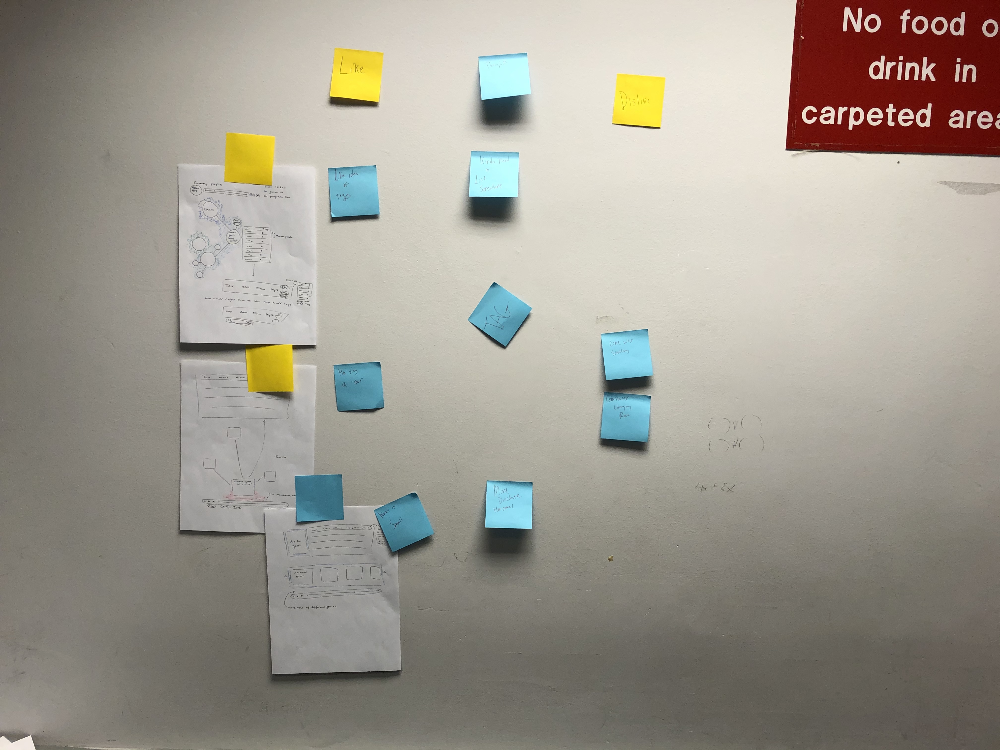
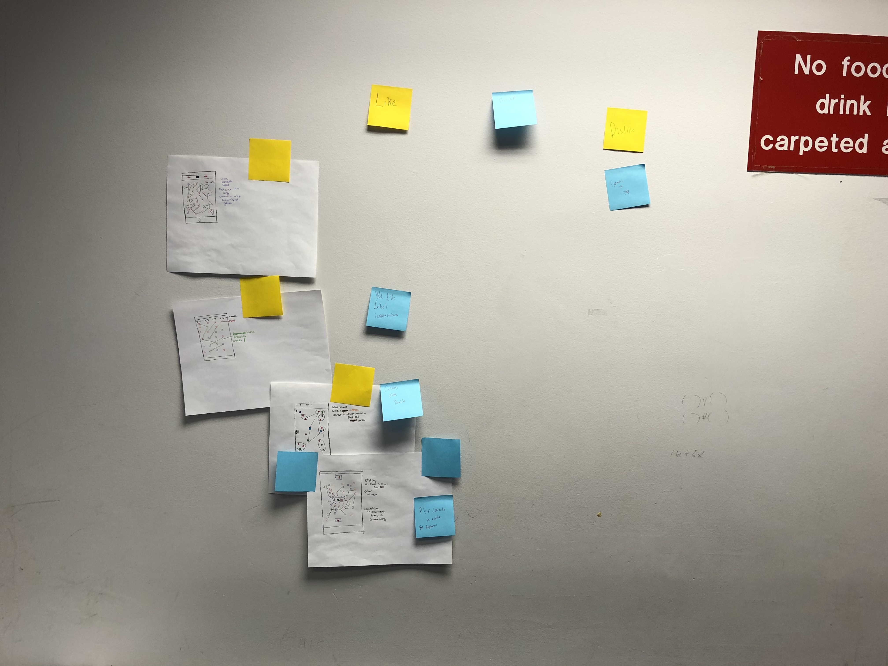
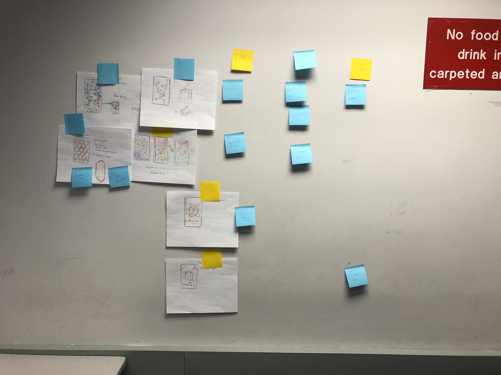

[home](https://colinauyeng.github.io/CPSC-481--MusicSurf/) - [Stage1](https://colinauyeng.github.io/CPSC-481--MusicSurf/Stage1) - [Stage2](https://colinauyeng.github.io/CPSC-481--MusicSurf/Stage2) - [Stage3](https://colinauyeng.github.io/CPSC-481--MusicSurf/Stage3) - [Stage4](https://colinauyeng.github.io/CPSC-481--MusicSurf/Stage4)   
## Stage 3: Ideation
[Low Fidelity prototype pdf](https://github.com/colinauyeng/CPSC-481--MusicSurf/raw/master/MusicSurf%20Low-Fi%20Submission.pdf)

[Low Fidelity prototype Adobe XD](https://github.com/colinauyeng/CPSC-481--MusicSurf/raw/master/MusicSurf%20Low-Fi%20Submission.xd)

[Demo](https://www.youtube.com/watch?v=NZVA_vplFzc)

### Brainstorming & Reflections
[Sketches](https://colinauyeng.github.io/CPSC-481--MusicSurf/Sketches)

Our brainstorming session consisted of all members presenting their individual sketches to the group, and eliciting feedback. Everyone explained their sketches and then we created an affinity diagram on the wall using sticky notes. For each sketch, we posted what we liked, what we didn’t like and any other miscellaneous thoughts that came to mind. However, many of our ideas/sketches were fairly similar to each other. Next time, in the early ideation stages we should not share ideas too much so everybody brings forth a fresh perspective.

On that note, it took us longer than expected to come up with a solid prototype design. Everyone had an idea of what we wanted to accomplish and emphasized making a design wholly different from anything currently existing. It is difficult to break away from media player design conventions that have been ingrained in us our whole lives and design something truly novel. Another difficulty we encountered was that though many of our preliminary designs were unique and visually innovative, they were not user friendly. To an extent, we had to sacrifice our desire for true novelty in order to make a functional design.

### Task Centered Walkthrough
[Detailed Document](https://github.com/colinauyeng/CPSC-481--MusicSurf/raw/master/Task%20Centered%20Design%20Walkthroughs.pdf)

Problems that may arise from our design stem from unfamiliarity with the elements that are utilized throughout the application. As it stands now, things such as tags, colors and what terms mean (i.e. “Discover new music”) would have to be learned by the user through trial and error and experimenting with our design. We will need to address that when creating our high fidelity prototype and ensure that the user definitively knows what effect their actions will have. On that note, we would also need to include clarifying text (i.e. “tempo” or “bpm”) in places where there are now symbols. Overall, our design has many features that are standard of media players and thus it should be easy for any previous music-listener to navigate. The issues come when our user is someone who has never before used a media player because our app has the standard layout of many other players with the addition of novel exploratory layers that are unique. One way to address this would be to include a tutorial explaining the application, although this risks alienating a user who is looking for a simple application for their purposes. It is not uncommon for someone to see how complex an application is and subsequently uninstall it.

