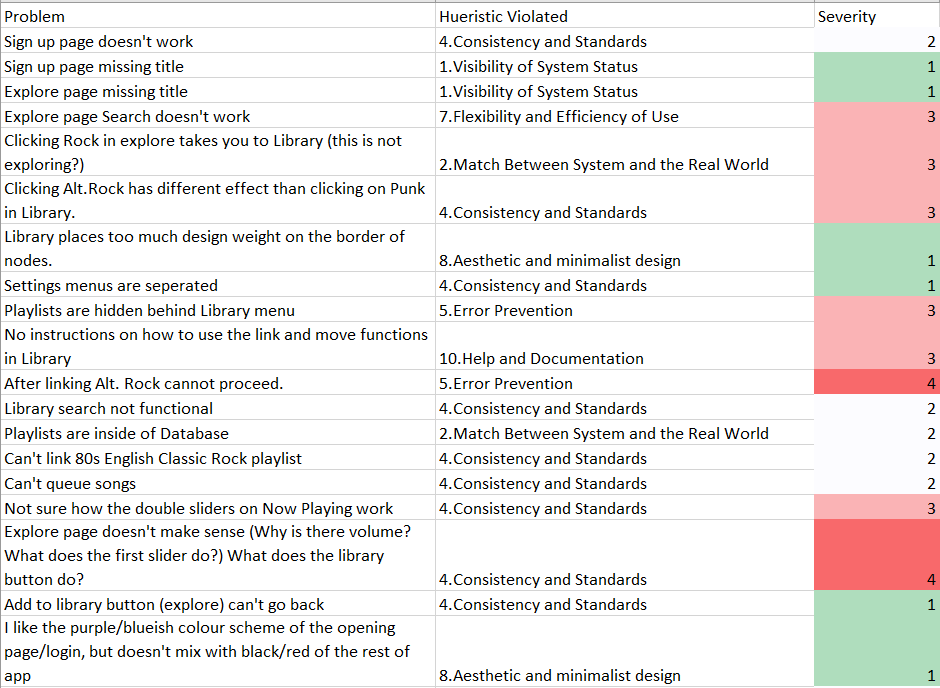
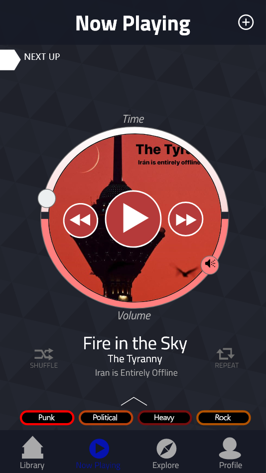
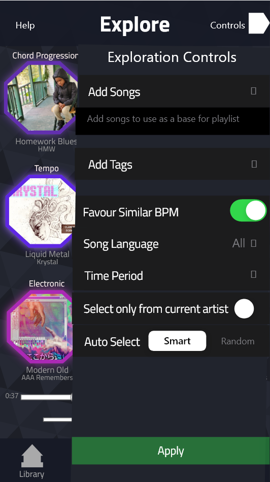
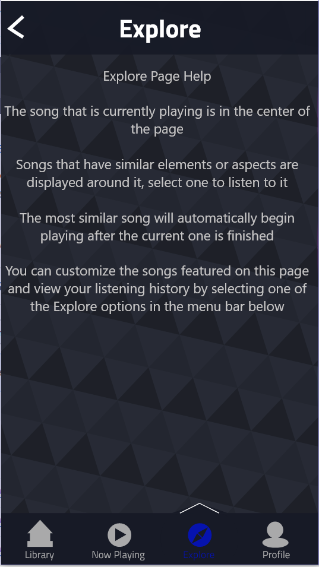
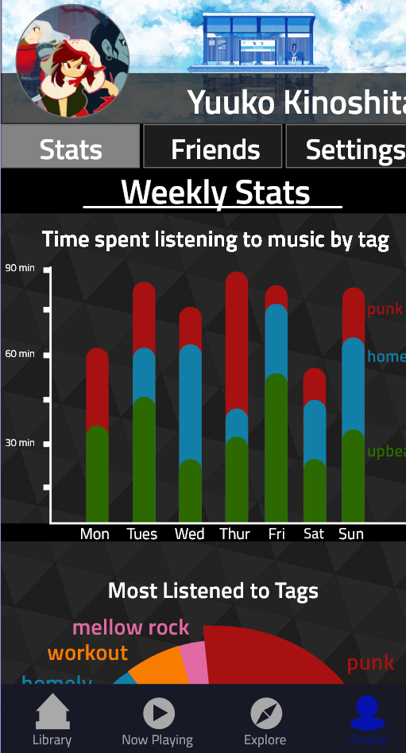
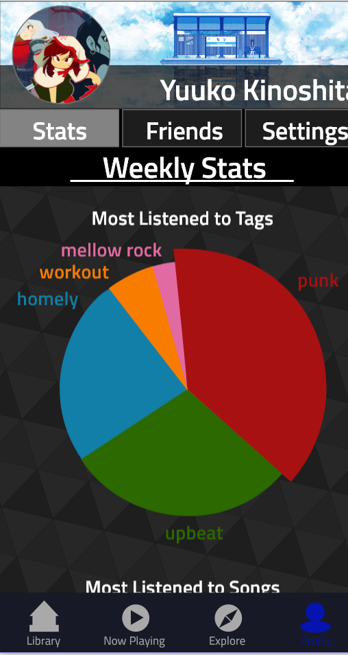
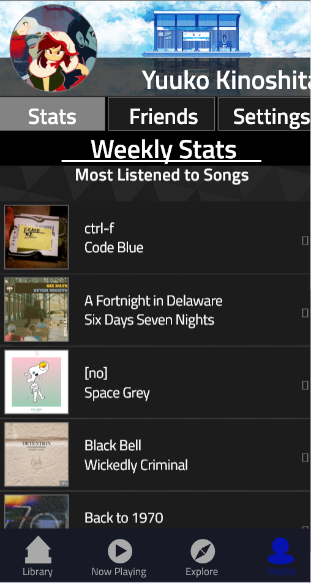
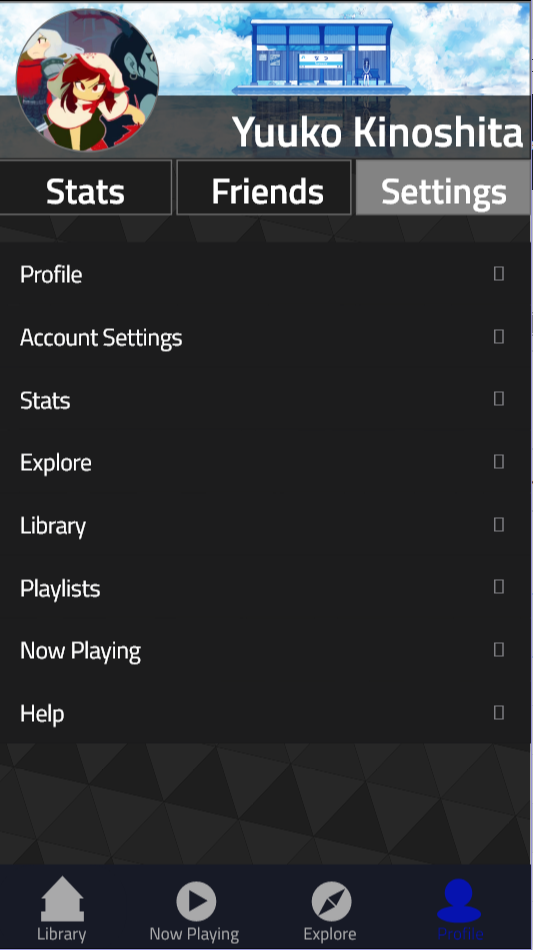

[Home](https://colinauyeng.github.io/CPSC-481--MusicSurf/) - [Stage1](https://colinauyeng.github.io/CPSC-481--MusicSurf/Stage1) - [Stage2](https://colinauyeng.github.io/CPSC-481--MusicSurf/Stage2) - [Stage3](https://colinauyeng.github.io/CPSC-481--MusicSurf/Stage3) - [Stage4](https://colinauyeng.github.io/CPSC-481--MusicSurf/Stage4) - [Stage5](https://colinauyeng.github.io/CPSC-481--MusicSurf/Stage5)  
## Stage 5: Final Project Iteration

[Final High Fidelity Prototype](https://drive.google.com/file/d/1YGWRNDLZexqBZQJFfyZv6C5ae9IFz7nT/view?usp=sharing)

[Stage 5 Presentation](https://docs.google.com/presentation/d/1r_z5hTgDfi-9M7GlhujWok-vSH9DAdP3jtr8uc9FcOg/edit?usp=sharing)

### Executive Summary

MusicSurf is an innovative music platform that enables its users to explore and organize music in a visual way. Currently, conventional music platforms like Spotify, Apple Music, and Youtube Music rely on lists to display music and black box algorithms to recommend it. However, this restricts users from freely navigating, discovering, and customizing their music listening experience. Our solution has benefits for music labels and music artists looking to distribute their music and find a new audience. MusicSurf is also tailored to music listeners, no matter their music exploration or library organization preferences. To better understand our end-users, we conducted interviews and secondary research. From the interviews, we found that people often find new music through friends and the recommendation algorithm of their prefered music platform. Interviewees also judged platforms based on ease of use and music selection. From our academic research, we learned that automatic grouping systems for music are feasible and that mood based categorization is a complex, but desirable, system for music organization. Based on these findings, we developed MusicSurf, focusing on the design and functionality of the exploration, library, and now playing features. 

For the library page, songs, playlists, and tag groups are displayed as nodes connected in a graph. This allows for the visual and spatial exploration and organization of the music collection at various levels. Additionally, graphs are commonly used to show information, so this should be fairly intuitive for the user. We used colours to differentiate moods and tags, which makes it easy to see how similar two songs are and draws upon existing colour associations. For the now playing page, we placed a graphic music player in the center that integrates album art, the play and skip buttons, and the volume and progress sliders. This circular element matches the theme of circular nodes in the library. There is also a hidden tab on the page to view the song queue, which allows users to access non-essential but useful information. Lastly, the song’s tags are displayed at the bottom of the screen and provide additional information on the song’s mood. For the exploration page, songs are displayed in a hexagon grid, which allows for the structured presentation of many songs that are related in different ways. This layout is clearly distinct from the library to ensure the user knows whether they are exploring music or browsing their collection. We anchored progress and volume bars at the bottom of the explore page to allow users to control their listening without having to navigate to the now playing screen. We also added a help menu, as this page contains several novel elements and users may be confused about the functionalities available. After developing a hi-fi prototype, we received a heuristic evaluation that outlined a few key problems. The first problem was the presence of minor functionality errors, inconsistencies, and bugs, however we were able to quickly address these. The main issue was that users were confused about the features of the explore, library, and now playing pages, as they were novel and not properly labeled or documented. To rectify this, we added supporting documentation and adjusted the layout to make it more intuitive and minimalistic. We also included features that users desired, like profile and friends pages. In the future, we hope to increase the supporting documentation, play with the colours and aesthetics, and continue optimizing the design of MusicSurf. 

### Introduction

Interfaces used to browse music typically follow a single paradigm: Lists. Every music player from Apple Music to Spotify uses a list interface that has been standard for time immemorial.  Lists are an excellent interface when you know what you are looking for and simply want to find it, however we felt the wheel could be reinvented when it comes to discovering new music.

Our group sought to iterate and innovate on the standard list interface to design a platform that empowers the user to visualize their music in a new way. Notably, our design emphasizes exploration and gives tools to the user to more freely discover new types of music. This is done by providing an easy to use interface that lets users “surf” through songs based on chosen parameters (i.e. mood, beats per minute, genre, time period, artist, etc.). Through MusicSurf, we wanted to make the discovery of new music intuitive and exciting, pushing users out of their music comfort zone.

### Design Problem

Current music platforms like Spotify or Youtube Music show music in a standard database style system and give recommendations through auto generated playlists. This means that users are not able to explore music freely and often only find new music due to auto generated recommendations, which they don’t have control over. The main design problem can be boiled down into a simple question. How can we create a music discovery platform that throws away the conventional list-based interfaces currently employed by music apps and provides a more visual way of exploring and organizing music? 

### End-users and Stakeholders

The stakeholders of the MusicSurf are music label companies and artists of any style and popularity. Music labels have a vested interest in how music is being shared and how it is being distributed. A system like MusicSurf provides new opportunities to get exposure for their music, but also forces them to redefine how they might advertise or categorize their music. In particular, MusicSurf will reduce the control that music labels have over the visibility of certain music types. For example, in the case of applications like Apple Music or Spotify, big artists are often featured on the page used for music exploration. MusicSurf will not have the same type of central hub for all users and its more custom exploration system will require different thinking in terms of how to sell music on such an application. 

MusicSurf aims to give exposure to a plethora of musical artists that have different styles and popularity. MusicSurf serves to enable niche music genres to reach the specific audience they’re targeting. This is hopefully to the benefit of smaller musicians who may have a style that is only appealing to a small demographic of the population (for example, a regional style such as bluegrass music). This also gives opportunities to bigger artists, allowing them more freedom to experiment with new musical genres and find an audience for these experiments. Overall, this platform provides opportunities to musicians to find new audiences, even if they represent a niche market. 

The end-users are anyone who listens to music, mainly people who want to discover new music and build their library. To accommodate a vast variety of music listeners, MusicSurf has features that cater to those with messy systems of organization, those with very structured approaches to their libraries, those who listen to a lot of different types of music, those who are often looking for something very specific, and those who are commonly looking for something random and brand new. 

For those with structured approaches to their music libraries, MusicSurf gives them the ability to organize their library with a tagging system that helps to automatically sort music into categories as well as smart features that help create playlists, which will take off some of the burden of manually generating these groupings. In addition, the visual display of music allows these sorted groups to have a spatial organization, giving these users even more power to sort their libraries.

For those with messy systems of organization, MusicSurf’s tagging systems give these users the ability to sort on the fly, helping them to find songs later with personalized tags. In addition, the visual aspect of MusicSurf can help these users remember where they “put the song down” similar to how some people remember where on a desk they left something. The automatic sorting features of MusicSurf should also help some of these users who don’t sort, because of lack of time or motivation, keep things organized.

For those who have a large library, MusicSurf’s visual representation of music will allow them to have a better sense of what songs belong in what categories and help them keep their interests separated. They can also use the connections between songs to help them find additional songs that fit into their wide assortment of music. 

For those searching for music, MusicSurf will give those looking for a particular type of music more ability to customize their search and listen as they search, allowing them to find what they want faster and helping them get into the more niche areas of what they’re looking for. For those users who are looking for something brand new, MusicSurf’s exploration functionality will give them the ability to gradually branch out into new areas of music from a comfortable jumping off point. 

### User Research and Findings

The first type of research we did was individual interviews. We used an open ended question format and this allowed us to engage with the interviewees and personalize the questions we asked. The first selection of questions allowed us to understand people’s music exploration preferences and thoughts on the existing music platforms they used. We learned about people's platforms and preferences so we could determine how they currently categorize and find music and what they would change in their music apps given the chance. The second set of interview questions helped reveal people’s music exploration processes and how they obtain new songs or create playlists. Learning why people prefer different platforms, how they categorize and find music, and what they would change about existing platforms was extremely valuable. As each question allowed for a fair amount of elaboration and follow-up, the interview format was ideal to flush out answers and get useful and actionable information. All the answers were recorded in a google form, which allowed us to compile the data, see trends, and draw conclusions.

The second method we used was secondary research. Each team member read and summarized two research papers that described a unique system for visual music exploration. The summarization of articles enabled us to quickly compare them and pick out the important components so we could take those into consideration when we were to design our concept and solution. This process helped us understand the variety of options not currently available to the public, their configurations, and the extent of their functionalities. We noted elements that were valuable and could be used in our solution and ones that we disliked that should be altered or discarded. The data we obtained from this research allowed us to make certain design choices that have been academically tested and that may differ from other existing music applications.

From our interviews, people listen to music during a variety of activities, but some stick out as being more frequent. Namely, when in transit. 100% of our interviewees reported that they listen to music when driving, riding the bus, walking, or partaking in other forms of transportation. Other common activities include working out and studying, and outliers are before going to bed.

The majority of respondents listen to their music on either Spotify or Youtube, with Apple music coming in third. Spotify and Youtube were highlighted due to it being easy to explore a large collection of music. Notably, YouTube was commended for its recommendation algorithm, which creates playlists based on users’ previous listening history. It appears that the prime factors for choosing a platform come down to price, ease, and selection.

When asked how they discover new music, respondents had similar answers. The majority either heard about a song from a friend or had it recommended based on a Spotify or Youtube playlist recommendation. When searching for new music, respondents reported that along with uniqueness, the expected mood of a song contributes to whether that song is saved to their personal collection. Few respondents reported that they listen to random playlists generated for them and keep the songs they “like”.

Platforms found in our secondary research, such as MIL [9], Playsom [7], Schedl et al.’s deepTune [8], and the one created by Muelder et al. [6] showed that automatic grouping systems for music using machine learning and similarity calculations are feasible and can produce understandable clusters to aid in the exploration of music. On the other hand, MuVis [3] and MusicalNodes [2] showed the effectiveness of graphical interfaces for the delivery of musical libraries. Both found their systems improved speed of navigation over traditional systems and saw a generally positive reception to a more visual model for displaying music libraries. Lee et al.’s [5] work on understanding how users define mood in music provided insights into how complicated users think mood in music is. Fujino et al. [4] and Moodplay [1] looked to deal with the issues of mood for song recommendation, with the former focusing on user feedback to define mood and the latter using visualization.

### Design and Justification 

For the library, we wanted to create a node based system in which songs, playlists, and tag groups are visualized as nodes that are connected in a graph based on similarities. Information on the edges between nodes is hidden to reduce clutter, but can be accessed by users who wish to know how the nodes are related. Additionally, edges can be added or removed and nodes can be moved by the user to customize the presentation of their library. In the beginning we had one layer to the user’s library, with songs represented by nodes in the graph. However, we encountered problems when we had a really big library, as the entire graph could not be seen on a single screen without the details of the songs and connections being lost. Thus, we changed our idea to incorporate a layer of nodes depicting tags. These tags are used to group songs in the library based on similarity, but do not have to be manually curated like a playlist. Playlists are displayed as nodes on their specific page in the same manner as tag groups are in the library to ensure consistency.
	
For the explore page, we wanted to provide a sense of freedom to the user’s movements but also did not want to overload the user with information. We represented songs as hexagons and placed them in the 3x3 grid like fashion with the currently playing song at the center. Initially, we wanted to show more songs as well as the pathways in the display, but ultimately decided it would make the page too crowded. In addition, since many users are utilizing music applications while in transit, a more complicated user interface would likely make it difficult for people to use the system during these common times. We opted to use labels for how songs are connected rather than a network approach, which we used in other areas of the application. Again, this was due to not wanting to overcomplicate this window. The combination of having multiple songs to select from as well as the music player built into the window already contribute to a high level of complexity. The reason we wanted to have the music player built into this window is so the user can continuously listen to music while exploring, as opposed to having to navigate to another window to control the music and then flipping back to the explore page for song selection. We specifically decided to integrate the controls for the explore mode into the window as a tab, since they were a set of options that the user might be using quite frequently in order to keep the exploration aligned with what they want.

The now playing window was designed to blend seamlessly with the library design. By using a circular layout for the song progression and volume, this page blends together with the circular nodes that the songs are displayed as. We tried to keep as many key functions of a standard music player in as possible while including elements of our tag system. For example, the color of the circle is meant to match the color that the song was given by it’s tags. The tags are always shown at the bottom to reinforce the idea of the tagging system. 

We integrated some light social features and analytics into the profile since they are common in many other music applications. They also help continue our theme of giving full exploration control to the user. The analytics help users understand the musical journey that they’ve been taking by providing them with statistics on what they’ve been listening to. Once again, the simplest graphics are used in order to minimize the learning required for the user to understand the data, and bright colors are used to go with the tagging system’s bright colors. For the social elements, the circular theme is continued on to blend with the circular theme of the song nodes. Social features were kept to a minimum in order to keep the complexity relatively low. We felt being able to see what others are listening to was the most important social aspect for our application, as word of mouth was a key way that people reported finding new music. Showing what others are listening to helps integrate the idea of discovering new music through word of mouth without the need for extra moderation that a comment or message system would require. We also went with a relatively simple way of finding friends, requiring you to either know their username or have their qr code, as our goal was not to create a networking application, but to give you some information about what your friends are listening to. 

The dark color scheme was chosen because we wanted to emphasize the color coding of our tag system. Giving the tags a bright vibrant color scheme helps to draw attention to each tag group and make each tag distinct. It also works with the futuristic design aesthetic that we went with in order to help blend together the node graph concept and the hexagonal elements of the explore page. The slight glow behind each element not only helps the elements standout from the background, but is used to establish the connection between elements. For example, on our main library window, you can see that the links have a glow that changes color between the two tags it links, which helps to establish the connection between the tags. The menus were kept in line with IOS’s standards for setting menus for the most part. Given that we were designing for the IOS platform and considering the high complexity level of the application, it made sense to keep the setting menus in line with what users are already used to, as to not create more for the user to learn when they already need to learn so much about our system. 
	
### Heuristic Evaluation and Findings

The evaluation of MusicSurf revealed minor understandability and consistency issues. There were no severe problems that would have been rated as a “5” on a 5 point scale. Most findings in the evaluation indicated that certain buttons, search bars, etc. were not implemented. This was unsurprising as we had not yet implemented every interactive element of our design at the time of evaluation. Inconsistencies in functionality were also revealed; some of the app’s pages were fully developed while others still had some work left to do. We planned to fix these issues and bugs, and implement error messages where features could not accommodate a user’s request.

A big source of contention was the “explore” page. The volume and track sliders at the bottom of the page were not clearly labeled, which was a source of confusion. The large number of elements on the page, the novel layout, and the lack of explanatory text all contributed to misunderstandings and confusion from the user. The same issues were present, albeit in a lesser capacity, on the “my library” and “now playing” pages. For example, the manipulation of connections between nodes and the functionalities related to them (i.e. more info, move, delete) were confusing to users on the “my library” page. On the “now playing” page, the creative presentation of the volume and progress bars, along with the lack of interactivity with the song queue were problematic. To address these problems we included documentation and labels on each page to help guide the user and ensure they knew how to take full advantage of the app’s functionality. We also reorganized the layout of the pages to make them more intuitive, minimalistic, and aesthetically pleasing. 
	
Additional suggestions in the heuristic evaluation related to aesthetic choices (i.e. colour scheme), dead-end screens (i.e. users can only use the back button to leave the page), button design, and headers and borders. We attempted to address some of these minor issues to polish our app and make it look professional. Further changes and additional features could be explored in the future to improve the utility and appeal of MusicSurf. 
  
Sample of the heuristic evaluation 

### Design Changes

1. Fixed the inconsistencies in functionality resulting from many interactive elements (buttons, search bars, etc.) being unresponsive
2. Fixed the bugs in the system
3. Changed the location of the exploration control menu to be more intuitive and integrated into the design
4. Added a help screen to the “explore” page to explain its features
5. Added labels to various elements to clearly state their purpose
6. Removed the unnecessary lyrics tab from the “now playing” page
7. Reconfigured the navigation bar
8. Replaced “settings” with a link to the user’s profile page in the navigation bar
9. Created a profile page that allows users to see their weekly listening patterns and most listened to songs
10. Implemented a friends features that allows users to add friends by QR code or name, and accept requests
10a. Users can view what a friend is currently listening to, songs they have recently listened to, and their recent playlists

Now playing page without lyrics tab

Exploration control menu integrated into the explore page

Explore page help documentation

Profile page

Friends page

Settings page

### Recommendations for Next Iteration

For the most part, the next iteration of the design only requires minor tweaks. There were no system-breaking design flaws revealed in our heuristic evaluation. The future of the design will focus on giving more information to the users in an intuitive and unobtrusive way, fixing inconsistencies in functionality, re-organizing certain pages, and re-evaluating the color scheme. The majority of the work would go towards providing helpful documentation so the user can leverage the full capabilities of MusicSurf. When planning this documentation, we should keep in mind that since our design is novel, there are many elements that would not be intuitive for new users. 

MusicSurf’s design appears to be on the right track with its innovative, yet understandable, user interface. Now the work must be done to properly on-board users to this new paradigm so that they may take full advantage of all its features.

### Conclusions

Our team set out with the unenviable task of innovating over the design of common music applications. It was challenging, but we were able to design an application with a fresh spin on discovering new music and organizing a music library. By emphasizing spatial and colored relationships between nodes and links, we were able to prototype a novel music surfing application. Although there are areas for improvement in our design, we have shown that innovation is possible in even the most common and well-used applications.

### References

[1] Andjelkovic, I., Parra, D., & Odonovan, J. (2016). Moodplay. Proceedings of the 2016 Conference on User Modeling Adaptation and Personalization - UMAP 16. doi: 10.1145/2930238.2930280

[2] Dalhuijsen, L., & van Velthoven , L. (2010). MusicalNodes – the visual music library . Proceedings of the 2010 International Conference on Electronic Visualisation and the Arts, 232–236.

[3] Dias, R. J., & Fonseca, M. (2010). MuVis: An application for interactive exploration of large music collections. MM'10 - Proceedings of the ACM Multimedia 2010 International Conference, 1043-1046.

[4] Fujino, H., Hasida, K., & Matsubara, Y. (2017). Music exploration by impression based interaction. Proceedings of the 2017 ACM Workshop on Exploratory Search and Interactive Data Analytics, 5-58. doi: 10.1145/3038462.3038468

[5] Lee, J. H., Hill, T., & Work, L. (2012). What does music mood mean for real users? Proceedings of the 2012 IConference on, 112-119. doi: 10.1145/2132176.2132191

[6] Muelder, C., Provan, T., & Ma, K.-L. (2010). Content based graph visualization of audio data for music library navigation. 2010 IEEE International Symposium on Multimedia, 129-136. doi: 10.1109/ism.2010.27

[7] Neumayer, R., Dittenbach, M., & Rauber, A. (2005). Playsom and Pocketsomplayer, alternative interfaces to large music collections. International Society for Music Information Retrieval.

[8] Schedl, M., Höglinger, C., & Knees, P. (2011). Large-scale music exploration in hierarchically organized landscapes using prototypicality information. Proceedings of the 1st ACM International Conference on Multimedia Retrieval, 1-7. doi: 10.1145/1991996.1992004

[9] Wu, X., Qiao, Y., & Tang, X. (2015). MIL: Music Exploration and Visualization via Lyric and Image. Proceedings of the 23rd ACM International Conference on Multimedia, 1011-1014.
