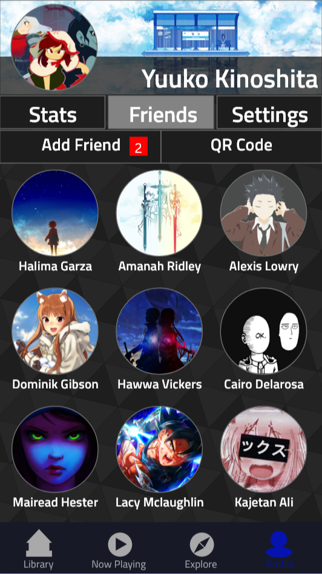
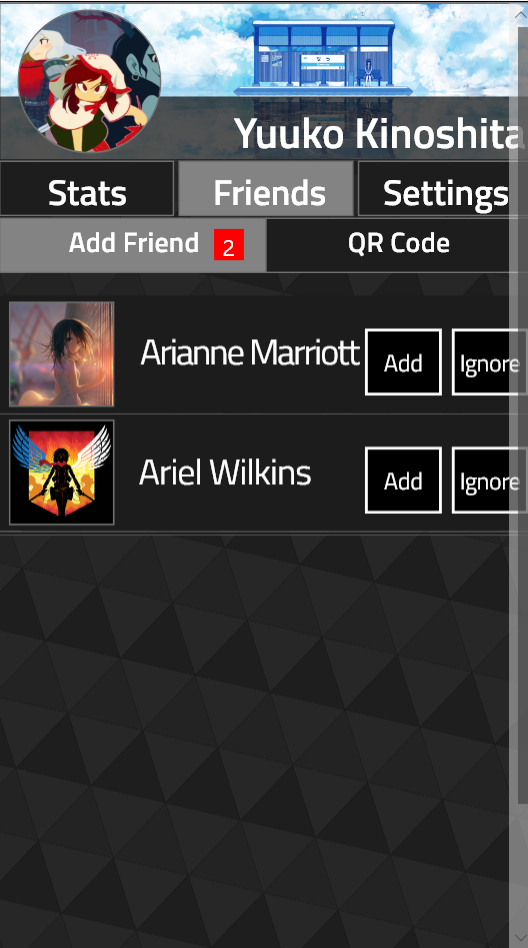

[Home](https://colinauyeng.github.io/CPSC-481--MusicSurf/) - [Stage1](https://colinauyeng.github.io/CPSC-481--MusicSurf/Stage1) - [Stage2](https://colinauyeng.github.io/CPSC-481--MusicSurf/Stage2) - [Stage3](https://colinauyeng.github.io/CPSC-481--MusicSurf/Stage3) - [Stage4](https://colinauyeng.github.io/CPSC-481--MusicSurf/Stage4) - [Stage5](https://colinauyeng.github.io/CPSC-481--MusicSurf/Stage5)  
## Stage 5: Final Project Iteration

[Final High Fidelity Prototype](https://drive.google.com/file/d/1YGWRNDLZexqBZQJFfyZv6C5ae9IFz7nT/view?usp=sharing)

[Stage 5 Presentation](https://docs.google.com/presentation/d/1r_z5hTgDfi-9M7GlhujWok-vSH9DAdP3jtr8uc9FcOg/edit?usp=sharing)

### Executive Summary

### Design Problem

### End-users and Stakeholders

### User Research and Findings

### Design and Justification 

### Heuristic Evaluation and Findings
A heuristic evaluation conducted on this prototype by another team of designers resulted a series of severe to minor bugs and technical difficulties.  

### Design Changes
Now playing page without lyrics tab

Exploration control menu integrated into the explore page

Explore page help documentation

Profile page

Friends page

Settings page

### Recommendations for Next Iteration

### Conclusions

